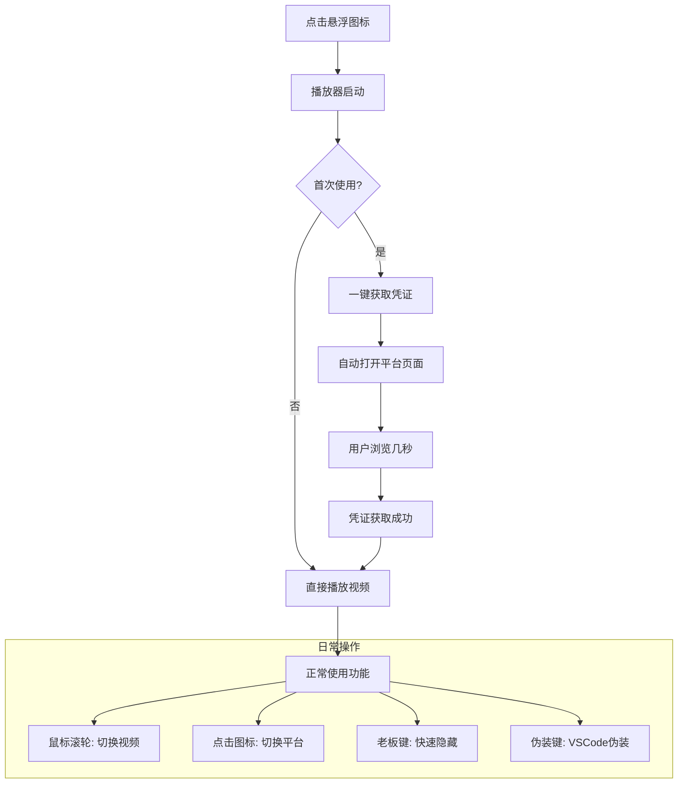
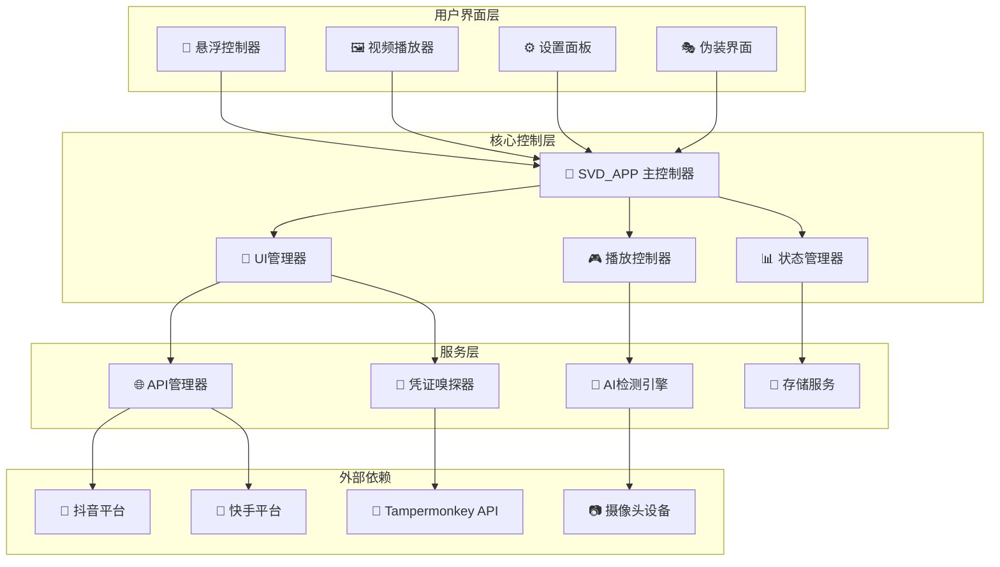
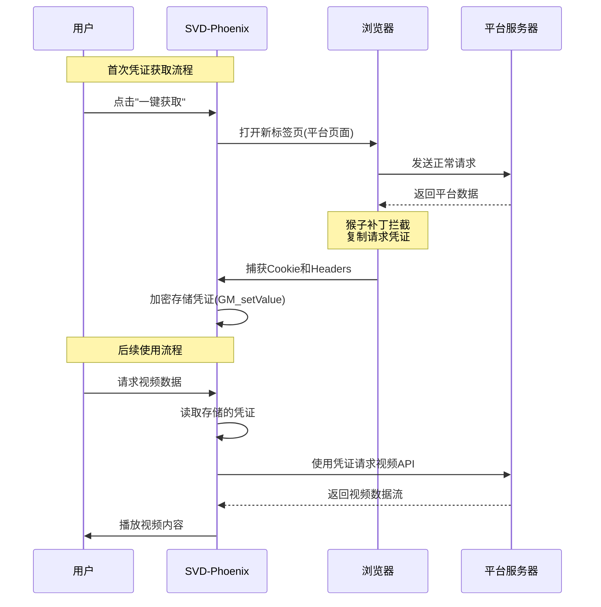
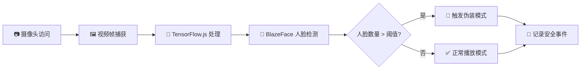
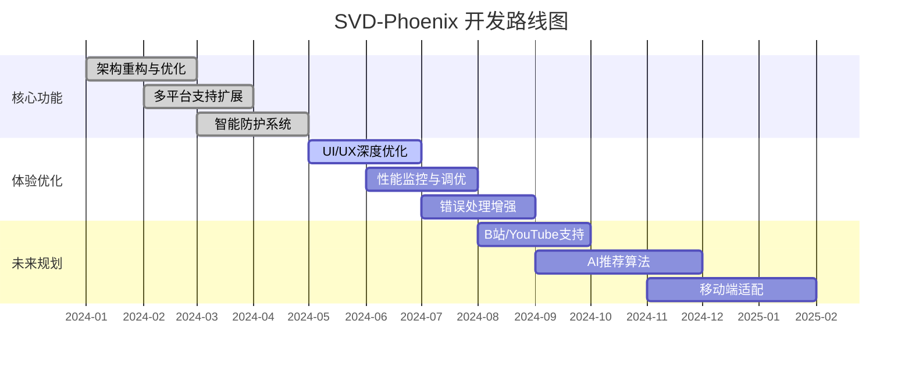

# SVD-Phoenix (天启信使·凤凰版) 🚀

<div align="center">

**一个会自我引导、追求极致体验的短视频摸鱼神器**

[](https://github.com/lzA6/SVD-Phoenix/raw/main/short-video-drifter-phoenix.user.js)
[](https://opensource.org/licenses/Apache-2.0)
[](https://github.com/lzA6/SVD-Phoenix)
[](https://github.com/lzA6/SVD-Phoenix)

</div>

---

## 🎬 项目演示
# 最初版本：
https://github.com/user-attachments/assets/d127b654-a3a7-488b-9878-6a051568caa1


# 改进后的1.0版本：
https://github.com/user-attachments/assets/09e94d45-5085-4b73-8e7c-bc00f1109b03


## 📖 目录导航

<details>
<summary>点击展开完整目录</summary>

- [🤔 项目哲学与初心](#-项目哲学与初心)
- [✨ 核心功能特性](#-核心功能特性)
- [🔧 快速安装指南](#-快速安装指南)
- [👨‍🏫 使用教程](#-使用教程)
- [🏗️ 系统架构设计](#️-系统架构设计)
- [🔬 技术实现原理](#-技术实现原理)
- [📊 项目发展蓝图](#-项目发展蓝图)
- [🤝 贡献指南](#-贡献指南)
- [📜 开源协议](#-开源协议)

</details>

---

## 🤔 项目哲学与初心

在快节奏的现代工作中，我们时常被"生产力"的枷锁束缚。但人非草木，孰能无情？适当的放松，短暂的"摸鱼"，并非懒惰的象征，而是为了更好地积蓄能量，是一种维持身心平衡的艺术，一种对枯燥日常的无声反抗。🧘‍♂️

**SVD-Phoenix** (Short Video Drifter Phoenix) 应运而生。它不仅仅是一个工具，更是一种态度的表达：**我们追求高效工作，也捍卫片刻喘息的权利。**

它为你提供一个悬浮、隐蔽、智能的窗口，让你在工作的间隙，瞥一眼世界的精彩。它像一只凤凰，浴火重生于无数代码行之上，只为给你带来极致、流畅、安心的"摸鱼"体验。

### ⚖️ 核心价值分析

| 优势方面 👍 | 挑战方面 👎 |
|------------|-------------|
| **🚀 极致便捷** - 无需安装APP，浏览器插件即装即用 | **🔧 依赖平台接口** - 需跟随平台API变化更新 |
| **🎭 高度隐蔽** - 多重防护机制，摸鱼于无形 | **🤖 AI功能实验性** - 可能消耗额外系统资源 |
| **⚡ 性能卓越** - CSS驱动UI，极低资源占用 | **⚖️ 道德边界** - 需合理使用，避免过度使用 |

---

## ✨ 核心功能特性

<div align="center">

### 🎯 功能特性一览

| 核心功能 | 智能防护 | 用户体验 |
|---------|----------|----------|
| 🖼️ **悬浮窗口** - 可拖动缩放 | 🔑 **老板键** - 自定义快捷键 | 🧠 **单例模式** - 全局唯一实例 |
| 🌐 **多平台支持** - 抖音/快手 | 🎭 **伪装模式** - VSCode界面伪装 | 🚀 **无感凭证** - 自动获取Token |
| 👻 **幽灵模式** - 智能显隐 | 🤖 **AI摄像头感应** - 人脸检测 | ⚙️ **设置面板** - 个性化配置 |

</div>

---

## 🔧 快速安装指南

### 第一步：安装用户脚本管理器

<div align="center">

| 浏览器 | 安装链接 | 推荐指数 |
|--------|----------|-----------|
| **Chrome** | [Tampermonkey 安装](https://chrome.google.com/webstore/detail/tampermonkey/dhdgffkkebhmkfjojejmpbldmpobfkfo) | ⭐⭐⭐⭐⭐ |
| **Microsoft Edge** | [Tampermonkey 安装](https://microsoftedge.microsoft.com/addons/detail/tampermonkey/iagcjkkmgdigmbnphjleaddniooahjki) | ⭐⭐⭐⭐⭐ |
| **Firefox** | [Tampermonkey 安装](https://addons.mozilla.org/en-US/firefox/addon/tampermonkey/) | ⭐⭐⭐⭐ |

</div>

### 第二步：安装 SVD-Phoenix 脚本

<div align="center">

[](https://github.com/lzA6/SVD-Phoenix/raw/main/short-video-drifter-phoenix.user.js)

*点击上方按钮，在弹出的 Tampermonkey 页面中确认安装*

</div>

---

## 👨‍🏫 使用教程

### 🎮 操作指南

<div align="center">



</div>

### ⌨️ 快捷键参考

| 功能 | 快捷键 | 说明 |
|------|--------|------|
| **显示/隐藏播放器** | `` ` `` (反引号键) | 快速隐藏，老板靠近时必备 |
| **启用伪装模式** | `Esc` | 瞬间变身VSCode界面 |
| **切换视频** | 鼠标滚轮上下 | 流畅切换上/下一个视频 |
| **切换平台** | 点击底部平台图标 | 在抖音/快手间切换 |

---

## 🏗️ 系统架构设计

<div align="center">

### 🏛️ 系统架构总览



</div>

### 🎯 核心模块说明

| 模块名称 | 职责说明 | 技术实现 |
|---------|----------|-----------|
| **SVD_APP** | 应用主入口，协调所有模块 | ES6 Class, 单例模式 |
| **UI管理器** | 管理所有界面组件和交互 | DOM操作, CSS动画, 事件处理 |
| **播放控制器** | 视频队列管理，播放控制 | 预加载, 缓存管理 |
| **API管理器** | 多平台数据适配 | Fetch API, 请求拦截 |
| **AI检测引擎** | 人脸识别和智能防护 | TensorFlow.js, BlazeFace模型 |

---

## 🔬 技术实现原理

### 🕵️‍♂️ 凭证嗅探机制

<div align="center">



</div>

### 🤖 AI智能防护系统

<div align="center">



</div>

### 🏛️ 单例UI架构

**技术亮点：**
- **跨标签页通信**: 使用 `BroadcastChannel` API
- **主从选举机制**: 确保全局唯一播放器实例
- **资源优化**: 避免重复创建UI，减少内存占用

---

## 📊 项目发展蓝图

### ✅ 已完成功能

<div align="center">

| 模块 | 完成状态 | 质量评级 |
|------|----------|-----------|
| 核心框架架构 | ✅ 已完成 | ⭐⭐⭐⭐⭐ |
| 多平台支持 | ✅ 已完成 | ⭐⭐⭐⭐ |
| 智能防护系统 | ✅ 已完成 | ⭐⭐⭐⭐ |
| UI/UX设计 | ✅ 已完成 | ⭐⭐⭐⭐⭐ |

</div>

### 🚧 开发路线图

<div align="center">



</div>

### 🎯 功能优先级矩阵

<div align="center">

| | 实现难度低 ⭐ | 实现难度中 ⭐⭐ | 实现难度高 ⭐⭐⭐ |
|----------------|-------------|---------------|----------------|
| **用户价值高** 🎁 | **主题定制**<br/>快捷键扩展 | **历史记录**<br/>收藏功能 | **AI智能推荐**<br/>行为分析 |
| **用户价值中** 💼 | 操作引导<br/>状态提示 | 性能优化<br/>缓存策略 | **B站支持**<br/>API适配 |
| **用户价值低** 🔧 | 日志系统<br/>错误上报 | 单元测试<br/>CI/CD | 架构重构<br/>插件化 |

</div>

---

## 🤝 贡献指南

我们相信，代码不仅是冰冷的逻辑，更是思想的载体。每一次 `issue` 的提出，每一次 `pull request` 的提交，都是一次宝贵的交流。

### 🛠️ 开发环境搭建

```bash
# 1. 克隆项目
git clone https://github.com/lzA6/SVD-Phoenix.git

# 2. 安装依赖 (如需构建)
npm install

# 3. 在 Tampermonkey 中加载脚本
# 将 short-video-drifter-phoenix.user.js 添加到用户脚本
```

### 📝 贡献流程

1. **Fork 项目仓库**
2. **创建功能分支** (`git checkout -b feature/AmazingFeature`)
3. **提交更改** (`git commit -m 'Add some AmazingFeature'`)
4. **推送到分支** (`git push origin feature/AmazingFeature`)
5. **开启 Pull Request**

### 🎯 急需贡献的领域

- 🔧 **平台适配**: B站、YouTube Shorts 支持
- 🎨 **UI/UX设计**: 新主题、交互动画优化
- 🧪 **测试覆盖**: 单元测试、集成测试
- 📚 **文档完善**: 使用教程、API文档

---

## 📜 开源协议

本项目采用 **[Apache License 2.0](https://github.com/lzA6/SVD-Phoenix/blob/main/LICENSE)** 开源协议。

### 📋 协议要点

| 你可以 ✅ | 你需要 📝 | 你不可以 ❌ |
|----------|-----------|-------------|
| 商业使用 | 保留版权声明 | 使用项目商标 |
| 修改代码 | 声明修改内容 | 追究作者责任 |
| 分发软件 | 包含许可证文本 | 附加法律条款 |


<div align="center">

## 🎉 感谢使用 SVD-Phoenix

**Made with ❤️ and a lot of ☕ by the community.**

[](https://star-history.com/#lzA6/SVD-Phoenix&Date)

*如果这个项目对你有帮助，请给我们一个 ⭐ 支持！*

</div>

---

<div align="center">

### 🔗 快速链接

[](https://github.com/lzA6/SVD-Phoenix/wiki)
[](https://github.com/lzA6/SVD-Phoenix/issues)
[](https://github.com/lzA6/SVD-Phoenix/issues/new?template=feature_request.md)
[](https://github.com/lzA6/SVD-Phoenix/discussions)

</div>
